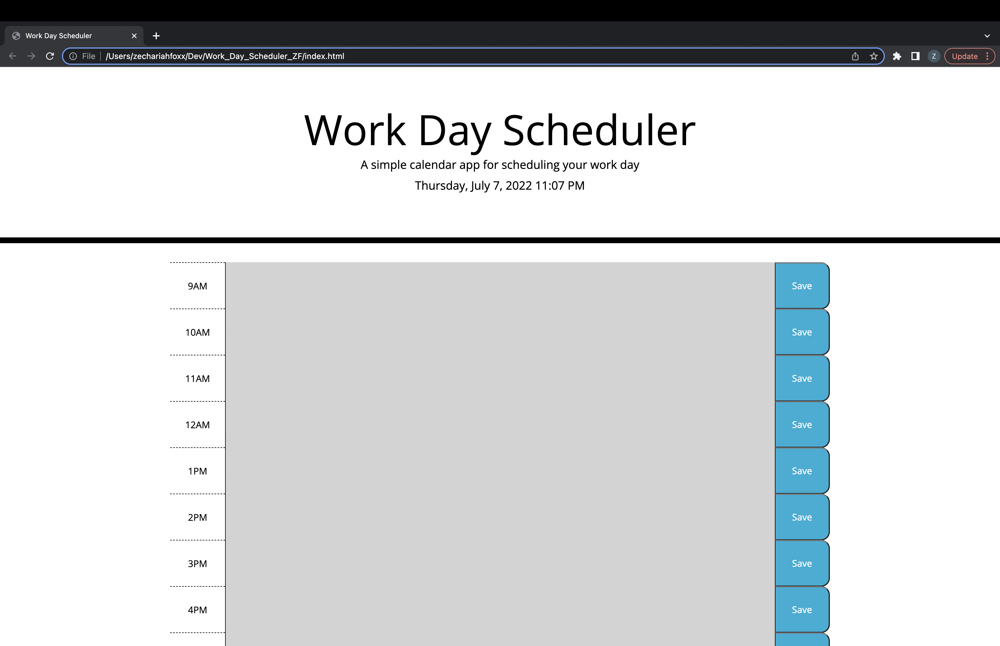

Created planner

Added current date/time to top of planner

Created color coded time blocks for business hours

Added localStorage to timeblocks so that events could be saved with save button

https://zakfoxx.github.io/Work_Day_Scheduler_ZF/

